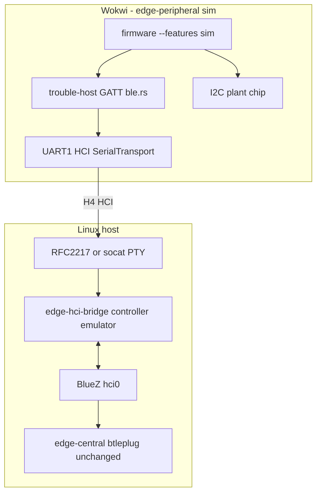

# Implementation Plan: BLE over UART (Linux Sim E2E)

## Overview

Enable **full-stack simulation** on Linux: Wokwi `edge-peripheral` (sensors + BLE GATT) talks HCI over UART to a **host controller emulator**, which registers with **BlueZ** so **edge-central** (btleplug, unchanged) can scan, connect, and sync as on real hardware.

Today:

- `hardware` uses esp-radio `BleConnector` → integrated ESP32 BT
- `sim` skips BLE entirely (`SimProcessor` logs flush, no `ble::run`)

Target:

- `sim` includes Wokwi I2C plant simulation **and** BLE over UART HCI
- `hardware` unchanged
- `edge-central` unchanged — runs on Linux against BlueZ

**Platform:** Linux only for central, HCI bridge, and emulation. macOS is out of scope.

## Architecture



### HCI roles

| Side | Role | Stack |
|------|------|-------|
| ESP sim firmware | HCI **host** | trouble-host + GATT |
| Linux bridge | HCI **controller emulator** | Parses commands from ESP, responds with events/ACL |
| Linux host | HCI **host** (central) | BlueZ ← btleplug |

The ESP sends HCI **commands** over UART; the bridge must **emulate a controller** and expose the peripheral to BlueZ. Plain `btattach` alone is insufficient (it attaches a real controller chip's UART, not an ESP host's UART).

### Transport glue (unchanged from prior analysis)

`BleConnector` and `SerialTransport` both implement `bt_hci::transport::Transport`. `ExternalController<T>` wraps either. `ble::run()` stays generic — no GATT rewrite.

```rust
pub type UartTransport<'d> =
    SerialTransport<NoopRawMutex, UartRx<'d, Async>, UartTx<'d, Async>>;
```

## Architecture Decisions

| Decision | Choice | Rationale |
|----------|--------|-----------|
| Purpose | Linux sim E2E | Peripheral + central without hardware radio |
| Feature model | **Single `sim`** with BLE-UART baked in | No separate `hci-uart` flag |
| `sim` BLE | UART `SerialTransport`, real `ble::run` | Replace skip-BLE `SimProcessor` flush path |
| `sim` sensors | Wokwi I2C (existing) | Unchanged plant chip |
| `hardware` | esp-radio `BleConnector` | Production path unchanged |
| UART for HCI | **UART1: TX GPIO17, RX GPIO16** | Keeps UART0 console/logs separate from binary HCI |
| UART0 | `$serialMonitor` / esp_println logs | Human-readable debug only |
| Wokwi export | `rfc2217ServerPort` in `wokwi.toml` + socat PTY | VS Code Wokwi → TCP → `/tmp/mycelium-hci` |
| Host bridge | `edge-hci-bridge` on **Linux** | Controller emulator + BlueZ VHCI integration |
| Central | `edge-central` on **Linux**, no code changes | btleplug → BlueZ |
| Baud | 115200 first (configurable) | Safer for virtual serial; tune later |
| Platform | **Linux only** | BlueZ + btattach/VHCI; macOS omitted |

## Dependency Graph

```
sim feature (merged)
  ├── bt-hci, embedded-io-async
  ├── hci_uart.rs
  ├── processor: sim uses UART + ble::run (not esp-radio)
  ├── sim_processor: sensor buffering + watering detect (no BLE skip)
  └── Wokwi: UART1 wiring + rfc2217ServerPort

edge-hci-bridge (Linux std crate)
  ├── PTY or RFC2217 client
  ├── HCI controller emulator (H4 parse/respond)
  └── BlueZ exposure (VHCI or equivalent)

edge-central (unchanged)
  └── btleplug → BlueZ
```

Build order: ESP `sim` UART path → Linux bridge → E2E with edge-central.

## Task List

### Phase 1: `sim` firmware with BLE over UART

#### Task 1: Merge BLE-UART into `sim` feature

**Description:** Extend `sim` to link `bt-hci` / UART transport and `trouble-host` without `esp-radio`.

**Acceptance criteria:**
- `sim` pulls `bt-hci`, `embedded-io-async`, `trouble-host`; not `esp-radio`
- `hardware` unchanged
- `cargo build --release --features sim` succeeds

**Verification:** `cargo build --release --features {hardware,sim}`

**Dependencies:** None | **Scope:** S

---

#### Task 2: `hci_uart.rs` — UART1 transport

**Description:** `UartTransport` + `init_hci_uart()` on UART1 GPIO16/17.

**Acceptance criteria:**
- `edge-peripheral/src/hci_uart.rs` gated on `sim`
- UART0 untouched (console)

**Verification:** compiles under `--features sim`

**Dependencies:** Task 1 | **Scope:** S

---

#### Task 3: Processor + `sim` BLE path

**Description:** In `sim` builds, use `ExternalController(UartTransport)` and real `ble::run` for `AwaitingTimeSync` and `Flush`. Keep sensor buffering in sim; remove BLE skip.

**Acceptance criteria:**
- `AwaitingTimeSync` / `Flush` call `ble::run` over UART in `sim`
- `Buffering` unchanged (Wokwi I2C)
- No `esp-radio` / `BleConnector` in `sim` binary

**Verification:** H4 bytes on UART1 when entering BLE states

**Dependencies:** Task 2 | **Scope:** M

---

#### Task 4: Wokwi UART wiring

**Description:** Export HCI UART to Linux host.

**Acceptance criteria:**
- `wokwi.toml`: `rfc2217ServerPort = 4000` (or documented port)
- `diagram.json`: UART1 pins for HCI (document if not physically wired; firmware uses GPIO16/17)
- UART0 remains `$serialMonitor` for logs
- Doc snippet: `socat pty,link=/tmp/mycelium-hci,raw,echo=0 tcp:localhost:4000`

**Verification:** socat creates PTY; Wokwi sim shows RFC2217 listener

**Dependencies:** Task 3 | **Scope:** S

---

### Checkpoint: Peripheral sim BLE bytes

- [ ] `sim` build passes; no esp-radio in tree
- [ ] Wokwi + RFC2217 + socat shows H4 traffic on BLE states
- [ ] Console logs still readable on UART0

---

### Phase 2: Linux host bridge

#### Task 5: `edge-hci-bridge` crate

**Description:** Linux std binary: HCI controller emulator between ESP UART PTY and BlueZ.

**Acceptance criteria:**
- New `edge-hci-bridge/` workspace crate
- CLI: `--pty /tmp/mycelium-hci --baud 115200`
- Parses H4 from ESP (commands); responds as controller (events, ACL)
- Registers peripheral with BlueZ so advertising is visible
- Logs packet types for debugging

**Verification:** Bridge starts; logs CMD/EVT when Wokwi peripheral enters `AwaitingTimeSync`

**Dependencies:** Task 4 | **Scope:** L

---

#### Task 6: Linux setup documentation

**Description:** `edge-peripheral/docs/ble-hci-uart.md` — Linux-only sim runbook.

**Acceptance criteria:**
- Prerequisites: Linux, BlueZ, Wokwi VS Code extension
- Steps: build `sim`, start Wokwi, socat, bridge, edge-central
- UART1 vs UART0 explained
- No macOS sections

**Verification:** Followable without reading source

**Dependencies:** Task 5 | **Scope:** S

---

#### Task 7: E2E sync on Linux

**Description:** Prove unchanged edge-central syncs against sim peripheral.

**Acceptance criteria:**
- `edge-central` discovers `Mycelium`
- Time sync (`SyncState::Done`)
- Measurement flush after buffering
- Documented command sequence

**Verification:** edge-central logs real `Events` from sim run

**Dependencies:** Task 5, Task 6 | **Scope:** M

---

### Checkpoint: Linux sim E2E

- [ ] Full path: Wokwi sim → UART → bridge → BlueZ → edge-central
- [ ] `hardware` build unaffected

---

### Phase 3: Polish (optional)

#### Task 8: CI compile gate

`cargo build --release --features sim` in Dagger/CI.

#### Task 9: Docker note (optional)

Document running edge-central in Linux container with `--net=host` and host BlueZ — only if needed beyond native Linux.

## Risks and Mitigations

| Risk | Impact | Mitigation |
|------|--------|------------|
| Controller emulator complexity | High | Start with minimal HCI: Reset, LE Set Adv*, connection events |
| RFC2217 maps to wrong UART | Med | UART1 in firmware; validate Wokwi serial mapping in Task 4 |
| Baud mismatch | Med | Default 115200; configurable both sides |
| Deep sleep re-inits UART | Med | Re-init UART1 each wake (same as gauge) |
| BlueZ permissions | Med | Document `bluetooth` group / sudo for bridge setup |

## Resolved Decisions

| Topic | Decision |
|-------|----------|
| Purpose | Linux sim E2E, not hardware dev bridge |
| Features | Single `sim` with BLE-UART included |
| UART pin | UART1 GPIO16/17 for HCI; UART0 for console |
| Host bridge | Custom controller emulator on Linux |
| Central | edge-central unchanged, Linux + BlueZ only |
| macOS | Omitted from scope |

## Build matrix

| Build | Sensors | BLE | Platform |
|-------|---------|-----|----------|
| `hardware` | Real I2C | esp-radio | ESP32 hardware |
| `sim` | Wokwi I2C | UART HCI | Wokwi + Linux bridge + edge-central |
